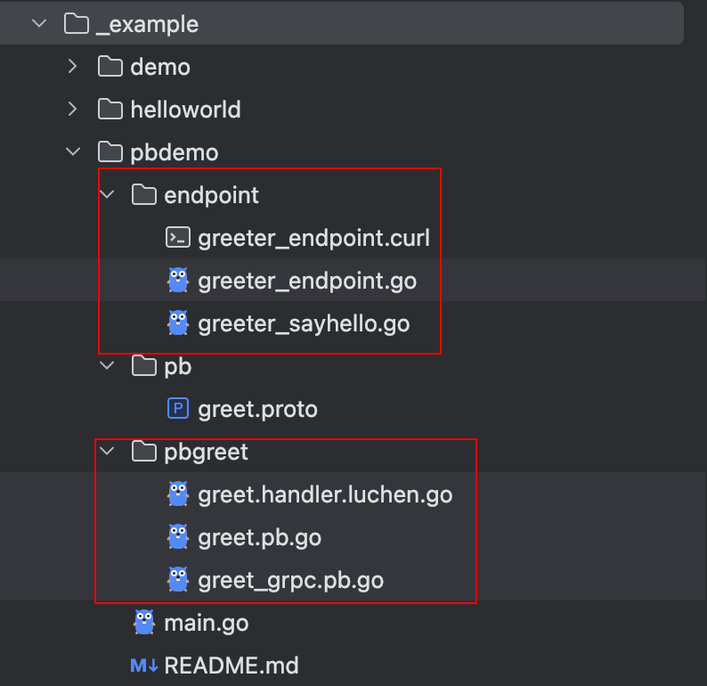

# 快速开始

## 一个http协议的helloworld程序 

<<< @/snippets/hello.go

启动服务
```bash
$ go run main.go
```

测试
```bash
curl 'http://localhost:8080/say-hello' \
--header 'Content-Type: application/json' \
--data '{
    "name": "fengjx"
}'
{"Msg":"hello fengjx"}
```

你可能会认为代码过于复杂，但是，根据过往大型项目的实践来看，必要的代码分层对于多人协作开发的项目至关重要，可以保持代码的可维护和可扩展性，这对于长期维护的项目收益巨大。

[完整代码](https://github.com/fengjx/luchen/blob/master/_example/helloworld/main.go)

## 使用 proto 协议进一步优化

使用 proto 协议定义接口，自动生成端点接口代码
```proto
// pbdemo/pb/greet.proto
syntax = "proto3";

package pb;

option go_package = "github.com/fengjx/luchen/example/pbdemo/pbgreet";

// gomodpath=github.com/fengjx/luchen/example
// epath=pbdemo/endpoint

// The greeting service definition.
service Greeter {
  // SayHello Sends a greeting
  // http.path=/say-hello
  rpc SayHello(HelloReq) returns (HelloResp) {}
}

// The request message containing the user's name.
message HelloReq { string name = 1; }

// The response message containing the greetings
message HelloResp { string message = 1; }
```
通过标准的 proto 协议来定义接口，详细说明参考：[协议](/guide/proto)

生成接口代码
```bash
lc pbgen -f pbdemo/pb/greet.proto
```

生成一下代码


注册端点接口到 http server
```go
package main

import (
	"github.com/fengjx/luchen"

	"github.com/fengjx/luchen/example/pbdemo/endpoint"
)

func main() {
	// 创建 http server
	hs := luchen.NewHTTPServer(
		luchen.WithServerAddr(":8080"),
	)

	// 注册 http 端点
	endpoint.RegisterGreeterHTTPHandler(hs)
	// 启动服务并监听 kill 信号
	hs.Start()
}
```

启动服务
```bash
go run main.go
```

[完整代码](https://github.com/fengjx/luchen/tree/master/_example/pbdemo)