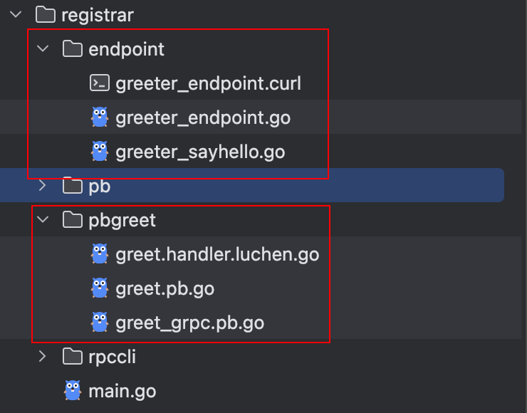

# grpc 服务


## 创建一个 gRPC server

```go
grpcServer := luchen.NewGRPCServer(
    luchen.WithServiceName("featgrpc"),
    luchen.WithServerAddr(":8088"),
)
```

```go
// NewGRPCServer 创建 grpc server
// opts 查看 ServerOptions
func NewGRPCServer(opts ...ServerOption) *GRPCServer

// ServerOptions server 选项
type ServerOptions struct {
    serviceName string
    addr        string
    metadata    map[string]any
}

// WithServiceName server 名称，在微服务中作为一组服务名称标识，单体服务则无需关注
func WithServiceName(serviceName string) ServerOption
// WithServerAddr server 监听地址
func WithServerAddr(addr string) ServerOption
// WithServerMetadata server 注册信息 metadata，单体服务无需关注
func WithServerMetadata(md map[string]any) ServerOption
```

## 根据 proto 文件生成相关代码

### 安装 lc 命令行工具

参考：[lc 命令行工具](/guide/lc)

### 生成代码

```bash
lc pbgen -f registrar/pb/greet.proto
```

生成代码如下


## 注册 grpc 服务端点

```go
package main

import (
	"time"

	"github.com/fengjx/go-halo/halo"
	"github.com/fengjx/luchen"

	"github.com/fengjx/luchen/env"
	"github.com/fengjx/luchen/example/registrar/endpoint"
)

func main() {
	// 创建 grpc server
	gs := luchen.NewGRPCServer(
		luchen.WithServiceName("grpc.helloworld"),
		luchen.WithServerAddr(":8088"),
	)

	// 注册 grpc 服务端点
	endpoint.RegisterGreeterGRPCHandler(gs)

    // 启动服务并监听 kill 信号
    gs.Start()
}
```

## 示例源码

- [registrar](https://github.com/fengjx/luchen/tree/master/_example/registrar)

